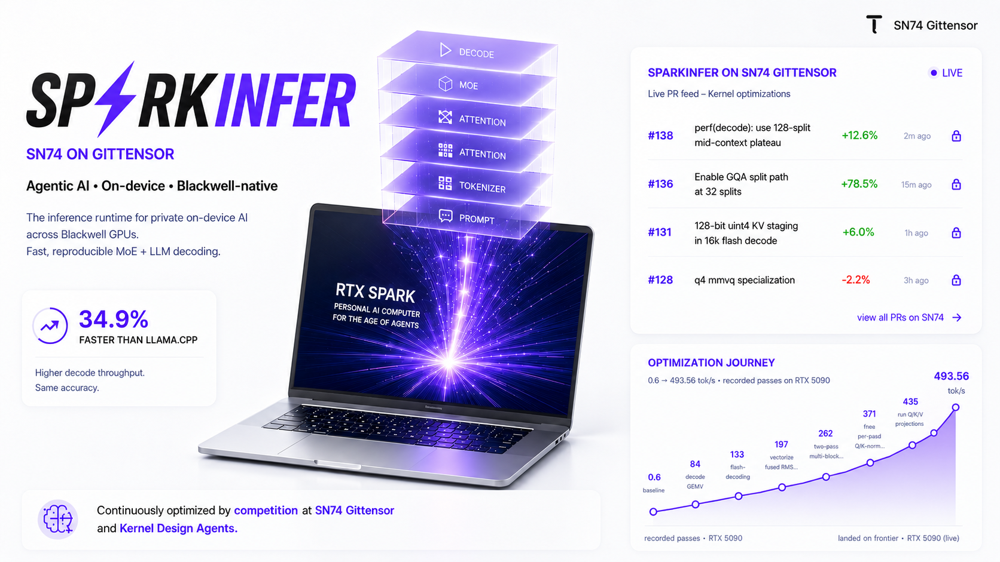

# SP⚡RKINFER

**Blackwell-native MoE/LLM inference runtime for SN74 on Gittensor.**

sparkinfer is the engineering loop for moving inference speed fast on consumer Blackwell GPUs:
small CUDA changes, source-built PRs, same-box RTX 5090 evals, correctness gates against
llama.cpp, and public run logs when a frontier PR lands.

The first target is Qwen3-30B-A3B / 35B-A3B Q4_K_M GGUF on `sm_120` / `sm_121`.
The current work is not broad framework coverage; it is a focused sprint to make one real
MoE decode path fast, measurable, and reproducible.

## Current progress

Live RTX 5090 frontier, same Q4_K_M GGUF, 128 generated tokens:

| context | sparkinfer | llama.cpp |
|---:|---:|---:|
| 128 | **493.56 tok/s** | 365.85 tok/s |
| 512 | **469.58 tok/s** | 342.59 tok/s |
| 4k | **392.65 tok/s** | 292.99 tok/s |
| 16k | **266.14 tok/s** | 245.53 tok/s |

The path so far:

- RTX PRO 6000 proof: Qwen3-30B-A3B runs end-to-end, resident at about 21.7 GB with experts kept quantized.
- RTX 5090 frontier: short-context decode moved from the initial 0.6 tok/s baseline to 493.56 tok/s.
- Long-context work is now measured explicitly at 512, 4k, and 16k context so optimizations cannot hide a regression in another context.
- Correctness is gated against llama.cpp with top-1 agreement and KL checks before any speed label is accepted.
- Every evaluated PR has a reproducible source build and a public run log.

Live data: [dashboard](https://gittensor-ai-lab.github.io/sparkinfer/dashboard/) ·
[eval logs](https://github.com/gittensor-ai-lab/sparkinfer-log) ·
[trust model](EVAL-TRUST.md) ·
[miner guide](docs/miner-guide.md)

## How we move fast on SN74

SN74 rewards verified speedups. The loop is intentionally tight:

1. Pick a narrow bottleneck in the Blackwell decode path.
2. Submit a PR with source changes and benchmark evidence.
3. The bot builds `main` and the PR on the same RTX 5090.
4. The bot checks correctness against llama.cpp and guards 128, 512, 4k, and 16k decode.
5. The strongest context improvement gets the score label; regressions get explicit `regression-*` labels.
6. A maintainer merges the best frontier PR, and the dashboard updates the matching context chart.

This keeps rewards tied to marginal speed on shipped code, not claims in a PR description.

## Why a custom engine

Datacenter engines optimize throughput for multi-user serving. llama.cpp is the portable baseline.
sparkinfer targets the gap between them: single-device, single-stream decode on consumer Blackwell
where bytes-per-token and kernel launch overhead decide whether local agents feel usable.

- **Blackwell-first.** Kernels are written for `sm_120` / `sm_121`, not treated as a fallback target.
- **MoE-specific.** Experts stay quantized-resident; decode focuses on reading fewer bytes per token.
- **Small and auditable.** CUDA kernels are readable, benchmarked directly, and easy to fork.
- **Eval-driven.** Speed only counts when the same-box bot verifies it and correctness holds.

## Quickstart

On an NVIDIA Blackwell box (CUDA 12.8+) — the scripts auto-detect your GPU arch, fetch **prebuilt binaries** (or build from source if incompatible), and download the model:

```bash
# decode throughput (fetches Qwen3-30B-A3B Q4_K_M on first run)
bench/scripts/bench.sh --download

# head-to-head vs llama.cpp on the same GGUF + GPU
bench/scripts/bench.sh --download --compare

# accuracy gate — token-match / KL / perplexity vs llama.cpp
bench/scripts/accuracy.sh --download
```

Your own model: `bench/scripts/bench.sh /path/to/model.gguf --tokens 256`. All options: [`bench/scripts/README.md`](bench/scripts/README.md).

## Miner guide

If you are contributing for SN74 rewards, start with the clear miner workflow:
[`docs/miner-guide.md`](docs/miner-guide.md). It explains what scores, what gets
rejected, how the 128 / 512 / 4k / 16k guards work, and the local commands to run
before opening a PR.

## Layout & scoring

| Path | What |
|---|---|
| [`kernels/`](kernels) | CUDA kernels — flash-decode (hd128/256/512), decode GEMV, fused quantized MoE expert FFN, GEMM, RMSNorm, RoPE, GGUF dequant |
| [`runtime/`](runtime) | scheduler, paged KV cache, CUDA-graph decode, native GGUF loading, model forward |
| [`moe/`](moe) | sync-free MoE router + expert dispatch (on-device counts, CUDA-graph-ready) |
| [`bench/`](bench) | reproducible benchmarks + eval harness (the eval/scoring scripts are maintainer-owned) |

**Scoring is speedup-only.** SN74 pays each merged PR for its verified marginal speedup,
labeled **XL / L / M / S / XS** by the deterministic eval loop. A speedup can land in
128, 512, 4k, or 16k context; sub-2% gains are never aggregated across contexts.
Tooling, bench, docs, and refactors are welcome but score 0 unless they produce a verified
frontier speedup. See [`.gittensor/weights.json`](.gittensor/weights.json) and the
[org reward model](https://github.com/gittensor-ai-lab).

## Build

Requires **CUDA Toolkit 12.8+** (first toolkit with `sm_120` / `sm_121` codegen).

```bash
cmake -B build -DCMAKE_CUDA_ARCHITECTURES=120   # or 121 for RTX Spark / Jetson Thor
cmake --build build -j
ctest --test-dir build
```

The top-level `CMakeLists.txt` is a superbuild (`kernels → moe → runtime`); each subsystem also builds standalone (the sibling `../kernels` references resolve within the monorepo). A direct `nvcc` build from the repo root works too — see [`bench/scripts`](bench/scripts).

## Targets

**Blackwell only, by design:** `sm_120` (RTX 5090, RTX PRO 6000) and `sm_121` (RTX Spark / GB10, Jetson Thor). **Not** `sm_100` (datacenter B200/GB200 — binary-incompatible).

## Roadmap

**Milestone 1 — RTX 5090 proof-of-concept (now).** Qwen3-MoE decode on `sm_120` with
source-verified, correctness-gated eval against llama.cpp. The 5090 is where we prove the kernels,
the scoring loop, and the long-context guards.

**Milestone 2 — long context.** Keep 128-token speed from regressing while pushing 16k and then
32k decode. This is now part of the eval surface, not a side benchmark.

**Milestone 3 — MoE on low-bandwidth unified memory.** Move the same engineering to RTX Spark /
GB10-class `sm_121` hardware. There the target shifts from raw occupancy to bytes-per-token:
NVFP4 experts, residency, prefetch, and eliminating redundant weight reads.

## Contributing

Source-required and reproducible — the validator builds your PR from source (the
prebuilt binaries are a run convenience, not a submission format). Before a PR, run
`bench/scripts/bench.sh` (speed) and `bench/scripts/accuracy.sh` (accuracy must hold:
~100% top-1 + KL ≈ 0 vs the prior build). Contributions are rewarded on SN74 by the
**verified marginal speedup** added over the live frontier, correctness-gated against a
frozen llama.cpp reference. See [CONTRIBUTING.md](CONTRIBUTING.md) and the
[org reward model](https://github.com/gittensor-ai-lab).

## Automated evaluation

Open a PR and a bot evaluates it automatically (polls every ~30 min). For each new commit it
builds your branch **from source** on an RTX 5090, gates **correctness** (token-match / KL vs
llama.cpp), checks that **128-token, 512-context, 4k-context, and 16k-context decode do not
regress**, scores the **strongest verified context improvement**, and posts a comment with an
**`eval:<label>`** verdict plus a UI-only context label such as `4k-context`:
Mixed outcomes are explicit: a real >2% win in one context can score while regressions elsewhere
are marked with `regression-*` labels and blocked from auto-merge; if no single context clears 2%
and any context regresses, the PR is `eval:REJECT` and auto-closed. Sub-2% gains are never
aggregated across contexts.

| label | meaning |
|---|---|
| `XL · L · M · S · XS` | verified speedup over the live frontier, by **% gain** (`XS` 2–3.5% … `XL` >18%) |
| `none` | correct, but no verified improvement (within the significance gate) |
| `REJECT` | failed correctness, or regressed below a no-regression guard |
| `BASELINE` | first verified entry; establishes the frontier |

The label is a **deterministic function of the measurements**, so it's reproducible across
validators. The bot also tags the PR's **subsystem** — `area:kernels` / `runtime` / `moe` /
`bench` — from its changed paths (categorization only — scoring is speedup-only; deterministic, no AI).
The bot **never merges** — merging is manual after review. Runs the same evaluator you can run
yourself: [`eval/`](eval) (`vast_eval.py`, `pr_eval_bot.py`).

### Trust & verifiability

Results are **reproducible from source today** — build `main` and the PR on the same RTX 5090 and you
get the same same-box delta (already independently reproduced by the community on a rented 5090). We're
hardening it toward **attested, multi-source eval**: CPU-TEE-signed scoring receipts (Intel TDX),
immutable run logs, and independent-validator consensus. Consumer 5090s have **no GPU Confidential
Computing**, so the *speed number* is trusted via **reproduction + consensus**, not a GPU enclave — by
design, since we optimize the hardware people actually own. → **[EVAL-TRUST.md](EVAL-TRUST.md)**

## License

[MIT](LICENSE) · [Changelog](CHANGELOG.md)
